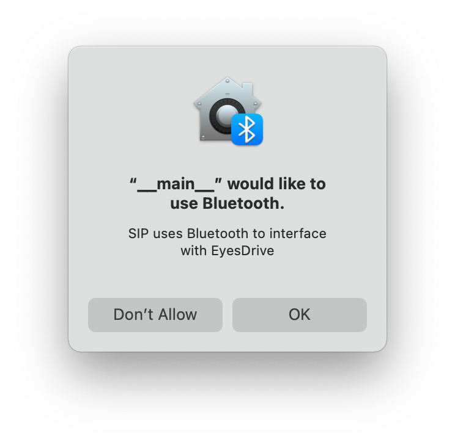

# Prepare development host
## Installing dependencies
### macOS
Be sure your user is entitled to have superuser rights. Open a new terminal window and type:
```
$ brew install python3
```
!!! Warning
    Starting from macOS Monterey, Apple locked down non-signed and non-UI apps to use CoreBluetooth. At the moment SIP cannot be used as a module unless the application is packaged, signed and entitled to use CoreBluetooth. In production systems, please use macOS Big Sur.
    
    A successful packaged application shows the following prompt at the first opening:
    


### Ubuntu, Debian or derivates
Be sure your user is entitled to have superuser rights. Open a new terminal window and type:
```
$ sudo apt install python3 python3-pip bluez
```
### Windows
!!! Warning

    Windows support is currently experimental, SIP and related applications/modules can be unstable. If you're planning to deploy your application on a PC Operating System, please consider UNIX based alternatives.
Open a new PowerShell terminal with administrative rights and type the following command:
```
> Set-ExecutionPolicy Bypass -Scope Process -Force; [System.Net.ServicePointManager]::SecurityProtocol = [System.Net.ServicePointManager]::SecurityProtocol -bor 3072; iex ((New-Object System.Net.WebClient).DownloadString('https://community.chocolatey.org/install.ps1'))
> choco install python
```
!!! Warning

    The ExecutionPolicy for PowerShell is set to Bypass only to install the Chocolatey package manager, at the end of the installation, the ExecutionPolicy will be resetted to Restricted


pip install bleak

## Installing SIP
The Sight Input Processor provides in depth debug capabilites while developing for EyesDrive. By connecting EyesDrive to SIP, the eye position can be visualized in real time along with connection statistics, live EOG plots and calibration values.

SIP could be also used in legacy codebases that would require major code changes to integrate them with EyesDrive by simulating keystrokes. To integrate your application via SIP, please see (Integrating your application with SIP)[#sip]

Open a new terminal window and paste the following command to install SIP:
```
pip install eyesdrive-sip
```
